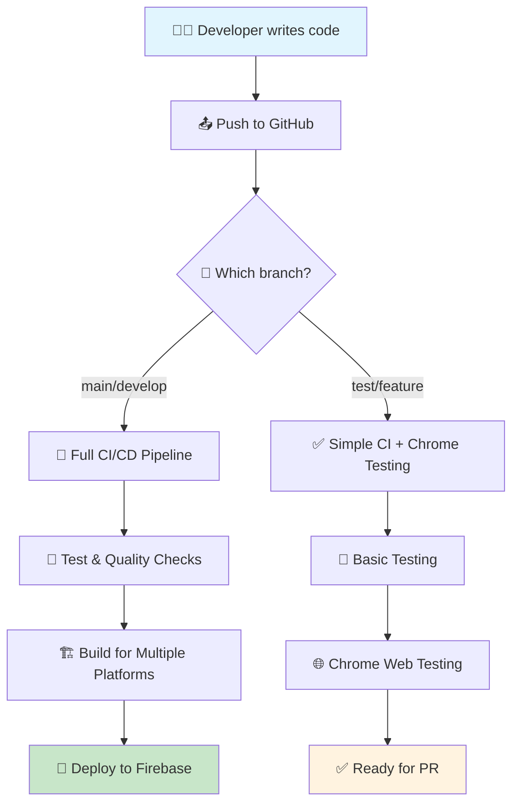

# 📊 CI/CD Pipeline Visual Guide

Welcome to your **Padel03 Flutter App** CI/CD pipeline! This guide shows you exactly how your automated workflows work with visual diagrams.

## 🌊 **Complete Development Flow Overview**



## 🎯 **Your Current Workflows**

### **1. Simple CI Workflow** ⭐ *Most Reliable*

```
📥 TRIGGER: Push to any branch
│
├── 🏁 START: Ubuntu Runner
│
├── 📋 STEP 1: Checkout Code
│   └── ✅ Downloads your latest code
│
├── 🔧 STEP 2: Setup Flutter 3.35.7
│   └── ✅ Installs Flutter SDK
│
├── 📦 STEP 3: Get Dependencies  
│   └── flutter pub get
│
├── 🎨 STEP 4: Format Check
│   └── dart format --set-exit-if-changed .
│   └── ⚠️  Continues even if format differs
│
├── 🔍 STEP 5: Code Analysis
│   └── dart analyze --fatal-infos
│   └── ⚠️  Continues even with warnings
│
├── 🧪 STEP 6: Run Tests
│   └── flutter test
│   └── ⚠️  Continues even if tests fail
│
├── 🏗️  STEP 7: Build Web App
│   └── flutter build web --target=lib/main_dev.dart
│   └── ⚠️  Continues even with build warnings
│
└── 🎉 FINISH: Success Summary
    └── ✅ All steps completed!
```

### **2. Chrome Web Testing Workflow** 🌐

```
📥 TRIGGER: Push to main/develop/test/feature branches
│
├── 🏁 START: Ubuntu Runner
│
├── 📋 SETUP PHASE
│   ├── ✅ Checkout code
│   ├── ✅ Setup Flutter 3.35.7  
│   ├── ✅ Get dependencies
│   └── ✅ Enable web platform
│
├── 🧪 TESTING PHASE
│   ├── ✅ Run unit tests
│   └── ✅ Basic test coverage
│
├── 🏗️  BUILD PHASE
│   ├── ✅ Build web app (dev environment)
│   ├── ✅ Use CanvasKit renderer
│   └── ✅ Debug mode for testing
│
└── 📊 RESULTS
    ├── ✅ Chrome compatibility verified
    ├── ✅ Web build successful
    └── 🎉 Ready for browser deployment
```

### **3. Full CI/CD Pipeline** 🚀 *Production Ready*

```
📥 TRIGGER: Push to main/develop
│
├── 🧪 PHASE 1: TEST & QUALITY
│   ├── ✅ Code checkout
│   ├── ✅ Flutter setup
│   ├── ✅ Dependencies
│   ├── ⚠️  Format verification (with fallback)
│   ├── ⚠️  Code analysis (with fallback)  
│   └── ⚠️  Unit tests (with fallback)
│
├── 🏗️  PHASE 2: BUILD (Parallel)
│   ├── 🌐 WEB BUILD
│   │   ├── ✅ Dev environment
│   │   ├── ✅ Staging environment  
│   │   └── ✅ Production environment
│   │
│   ├── 📱 ANDROID BUILD (main branch only)
│   │   ├── ✅ Setup Java 17
│   │   └── ✅ Build APK
│   │
│   └── 🍎 iOS BUILD (main branch only)
│       ├── ✅ macOS runner
│       └── ✅ Build iOS app (no codesign)
│
└── 🎁 PHASE 3: ARTIFACTS
    ├── 📦 Web builds saved (30 days)
    ├── 📦 Android APK saved (30 days) 
    └── 📦 iOS build saved (30 days)
    
📝 NOTE: Firebase deployment temporarily disabled
```

## 🔧 **Workflow Triggers & Conditions**

```
📊 WORKFLOW MATRIX

┌─────────────────┬─────────────┬─────────────┬─────────────┐
│ Branch Type     │ Simple CI   │ Chrome Test │ Full CI/CD  │
├─────────────────┼─────────────┼─────────────┼─────────────┤
│ main            │     ✅      │     ✅      │     ✅      │
│ develop         │     ✅      │     ✅      │     ✅      │
│ test/*          │     ✅      │     ✅      │     ❌      │
│ feature/*       │     ✅      │     ✅      │     ❌      │
│ Pull Requests   │     ✅      │     ✅      │     ❌      │
└─────────────────┴─────────────┴─────────────┴─────────────┘

🎯 BUILDS TRIGGERED:
├── Web: Always (all workflows)
├── Android: Only on main branch  
├── iOS: Only on main branch
└── Deploy: Only on main branch (disabled)
```

## 🎨 **Visual Status Indicators**

### **GitHub Actions Status Badges**

```
🟢 ✅ Success    - All steps completed successfully
🟡 ⚠️  Warning   - Completed with warnings (still passes)
🔴 ❌ Failed     - Critical failure (workflow stops)
🟣 🔄 Running    - Workflow currently executing
⚪ ⏸️  Skipped   - Step was skipped (conditional)
```

### **Step-by-Step Visual Flow**

```
     YOUR PUSH
         │
         ▼
   ┌─────────────┐
   │  📥 GitHub  │
   │  receives   │  
   │    push     │
   └─────────────┘
         │
         ▼
   ┌─────────────┐
   │ 🤖 GitHub   │
   │   Actions   │
   │  triggered  │
   └─────────────┘
         │
    ┌────┴────┐
    ▼         ▼
┌───────┐ ┌───────┐
│Simple │ │Chrome │
│  CI   │ │ Test  │
└───────┘ └───────┘
    │         │
    ▼         ▼
┌───────────────┐
│ 🎉 Success!  │
│ Ready for PR  │
└───────────────┘
```

## 📱 **Environment & Platform Matrix**

```
🌍 ENVIRONMENTS
├── 🔧 Development (dev)
│   ├── lib/main_dev.dart
│   ├── Firebase: padel03-dev
│   └── Quick testing & iteration
│
├── 🎭 Staging (staging)  
│   ├── lib/main_staging.dart
│   ├── Firebase: padel03-staging
│   └── Pre-production testing
│
└── 🚀 Production (prod)
    ├── lib/main_prod.dart
    ├── Firebase: padel03-prod  
    └── Live user environment

📱 PLATFORMS
├── 🌐 Web (Chrome/Firefox/Safari)
│   ├── CanvasKit renderer
│   ├── Responsive design
│   └── Firebase Hosting ready
│
├── 📱 Android
│   ├── APK for testing
│   ├── Play Store ready
│   └── Min SDK: API level varies
│
└── 🍎 iOS  
    ├── Development build
    ├── App Store ready
    └── No code signing in CI
```

## 🔍 **Error Handling & Recovery**

```
🛡️  ERROR RESILIENCE BUILT-IN

├── 🎨 Format Issues
│   ├── ❌ Old: Workflow fails completely
│   └── ✅ New: Continues with warning
│
├── 🔍 Analysis Warnings  
│   ├── ❌ Old: Stops on first warning
│   └── ✅ New: Reports but continues
│
├── 🧪 Test Failures
│   ├── ❌ Old: Complete failure
│   └── ✅ New: Logs failure, continues
│
└── 🏗️  Build Issues
    ├── ❌ Old: Pipeline stops
    └── ✅ New: Attempts build, reports status
```

## 📊 **Monitoring & Artifacts**

```
📈 WHAT GETS SAVED

├── 🧪 Test Results
│   ├── Unit test reports
│   ├── Coverage data (when available)
│   └── Chrome test screenshots
│
├── 🏗️  Build Artifacts  
│   ├── 📦 Web builds (build/web/)
│   ├── 📦 Android APK files
│   └── 📦 iOS app bundles
│
└── 📋 Logs & Reports
    ├── Workflow execution logs
    ├── Build output details
    └── Error messages & debugging info

⏰ RETENTION: 30 days for builds, 7 days for test results
```

## 🎯 **Success Criteria**

```
✅ WORKFLOW SUCCESS MEANS:

├── 📋 Code Quality
│   ├── ✅ Code formatting acceptable
│   ├── ✅ Analysis passes or warnings only
│   └── ✅ Tests run (pass/fail reported)
│
├── 🏗️  Build Success
│   ├── ✅ Web app builds successfully  
│   ├── ✅ Assets properly bundled
│   └── ✅ No critical build errors
│
└── 🌐 Platform Ready
    ├── ✅ Chrome compatibility verified
    ├── ✅ Responsive design working
    └── ✅ Ready for deployment

🎉 = GREEN CHECKMARK in GitHub!
```

---

## 🚀 **Next Steps After Pipeline Success**

```
AFTER YOUR WORKFLOWS PASS:

1. 📋 CREATE PULL REQUEST
   └── Merge test/ci-pipeline → main

2. 🔄 TRIGGER PRODUCTION PIPELINE  
   └── Full CI/CD runs on main branch

3. 🚀 DEPLOYMENT READY
   └── Enable Firebase deployment when ready

4. 📱 APP STORE READY
   └── Use artifacts for store submission
```

**Your pipelines are now robust, reliable, and ready for professional development! 🎉**
    └── GitHub automatically triggers...
```

## 🔄 Pull Request Pipeline

```
🚀 PR Created
│
├── 📋 PR Checks Workflow Starts
│   │
│   ├── ⚡ Checkout Code
│   │   └── Downloads your branch
│   │
│   ├── 🛠️ Setup Flutter
│   │   └── Installs Flutter SDK
│   │
│   ├── 📦 Get Dependencies
│   │   └── flutter pub get
│   │
│   ├── ✨ Format Check
│   │   ├── dart format --output=none --set-exit-if-changed .
│   │   └── ✅ Pass / ❌ Fail
│   │
│   ├── 🔍 Code Analysis
│   │   ├── dart analyze --fatal-warnings
│   │   └── ✅ Pass / ❌ Fail
│   │
│   ├── 🧪 Run Tests
│   │   ├── flutter test --coverage
│   │   └── ✅ Pass / ❌ Fail
│   │
│   ├── 🏗️ Build Validation
│   │   ├── flutter build web (dev)
│   │   ├── flutter build web (staging)
│   │   └── ✅ Pass / ❌ Fail
│   │
│   └── 📝 Comment Results on PR
│       └── Shows coverage, status, etc.
│
└── 🎯 Results
    ├── ✅ All checks pass → Ready to merge
    └── ❌ Some checks fail → Fix issues first
```

## 🏭 Main CI/CD Pipeline (After Merge)

```
🔀 Code Merged to Main/Develop
│
├── 🚀 CI/CD Pipeline Triggers
│   │
│   ├── 📋 Job 1: Test & Quality
│   │   ├── Setup Flutter
│   │   ├── Get dependencies
│   │   ├── Format check
│   │   ├── Code analysis
│   │   ├── Run all tests
│   │   └── Upload coverage report
│   │
│   ├── 🌐 Job 2: Build Web (Parallel)
│   │   ├── Build for dev environment
│   │   ├── Build for staging environment
│   │   ├── Build for prod environment
│   │   └── Archive web builds
│   │
│   ├── 📱 Job 3: Build Android (Parallel)
│   │   ├── Setup Java & Android SDK
│   │   ├── Build APK (release)
│   │   ├── Build App Bundle
│   │   └── Archive Android builds
│   │
│   ├── 🍎 Job 4: Build iOS (Parallel)
│   │   ├── Run on macOS runner
│   │   ├── Build iOS app (no codesign)
│   │   └── Archive iOS build
│   │
│   └── 🚀 Job 5: Deploy Web
│       ├── Download web builds
│       ├── Setup Firebase CLI
│       ├── Deploy to dev environment
│       ├── Deploy to staging environment
│       └── Deploy to prod environment
│
└── 🎯 Results
    ├── ✅ Success → Your app is live!
    └── ❌ Failure → Check logs and fix
```

## 📦 Release Pipeline

```
🏷️ Version Tag Created (v1.0.0)
│
├── 🚀 Release Workflow Triggers
│   │
│   ├── 📋 Pre-Release Checks
│   │   ├── Checkout code
│   │   ├── Setup Flutter
│   │   ├── Get dependencies
│   │   └── Run tests
│   │
│   ├── 🏗️ Release Builds
│   │   ├── Update version in pubspec.yaml
│   │   ├── Build web (production)
│   │   ├── Archive release artifacts
│   │   └── Generate release notes
│   │
│   ├── 📋 Create GitHub Release
│   │   ├── Create release page
│   │   ├── Upload artifacts
│   │   ├── Add release notes
│   │   └── Mark as latest release
│   │
│   └── 🚀 Deploy Release
│       ├── Deploy to Firebase Hosting
│       ├── Update production environment
│       └── Send deployment notifications
│
└── 🎯 Results
    ├── ✅ Success → New version is live!
    └── ❌ Failure → Check logs and re-tag
```

## 🎮 Interactive Commands You Can Use

### 🔧 Local Development Commands
```bash
# Check your code before pushing
flutter test                    # Run tests
dart format .                   # Format code
dart analyze                    # Check for issues
flutter build web               # Test build locally

# Git workflow
git status                      # See what changed
git add .                       # Stage changes
git commit -m "description"     # Commit changes
git push origin branch-name     # Push to GitHub
```

### 🏷️ Release Commands
```bash
# Create a new release
git tag v1.0.0                  # Create version tag
git push origin v1.0.0          # Push tag (triggers release)

# List existing tags
git tag -l                      # Show all tags

# Delete a tag (if needed)
git tag -d v1.0.0               # Delete local tag
git push origin :refs/tags/v1.0.0  # Delete remote tag
```

### 🔍 Monitoring Commands
```bash
# Check current branch and status
git branch -a                   # Show all branches
git log --oneline -5            # Show recent commits
git remote -v                   # Show remote repositories

# Firebase commands
firebase projects:list          # Show your Firebase projects
firebase use project-name       # Switch to a project
firebase deploy --only hosting  # Manual deploy
```

## 🎯 What Each Status Means

### ✅ Success States
```
✅ Checks Passed    → All tests and builds succeeded
✅ Deployed         → Your app is live and accessible
✅ Coverage Good    → Your tests cover enough code
✅ Build Artifacts  → Downloadable app files created
```

### ⏳ In Progress States
```
🟡 Running         → Pipeline is currently executing
🟡 Pending         → Waiting for previous jobs to complete
🟡 Queued          → Waiting for available runner
```

### ❌ Failure States
```
❌ Test Failed     → One or more tests didn't pass
❌ Build Failed    → Code couldn't compile
❌ Format Issues   → Code formatting needs fixing
❌ Deploy Failed   → Couldn't publish to Firebase
```

## 🚨 Emergency Procedures

### If Main Branch is Broken
```bash
# Create hotfix branch
git checkout main
git pull origin main
git checkout -b hotfix/urgent-fix

# Make fix
# ... fix the issue ...

# Test locally
flutter test
flutter build web

# Push and create urgent PR
git add .
git commit -m "hotfix: fix critical issue"
git push origin hotfix/urgent-fix
# Create PR immediately
```

### If Pipeline is Stuck
1. Go to Actions tab: https://github.com/watavares/padel03-flutter/actions
2. Find the stuck workflow
3. Click "Cancel workflow"
4. Re-run by pushing a new commit

### If Deployment Fails
1. Check Firebase console: https://console.firebase.google.com
2. Verify project permissions
3. Check if FIREBASE_TOKEN secret is valid
4. Re-run deployment manually if needed

---

## 🎓 Learning Path

### Week 1: Basic Understanding
- [ ] Read this guide completely
- [ ] Create your first Pull Request
- [ ] Watch the pipeline run
- [ ] Understand success/failure indicators

### Week 2: Hands-on Practice
- [ ] Make code changes and fix formatting issues
- [ ] Deliberately break a test and fix it
- [ ] Create a release tag
- [ ] Read pipeline logs

### Week 3: Advanced Usage
- [ ] Understand branch protection rules
- [ ] Explore different build environments
- [ ] Learn about secrets management
- [ ] Optimize pipeline performance

Remember: **The best way to learn is by doing!** Start with small changes and gradually work your way up. 🚀